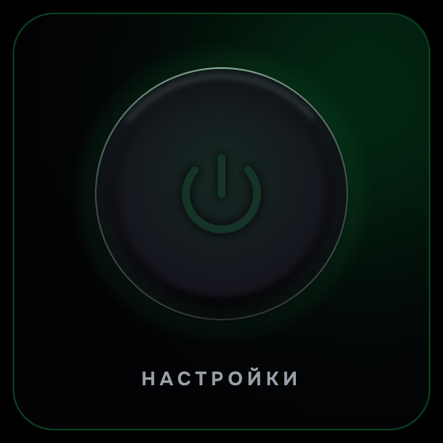
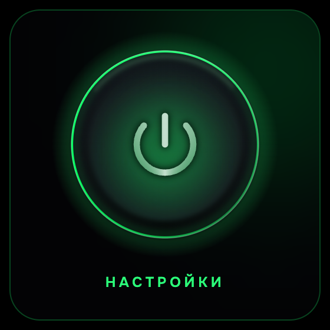
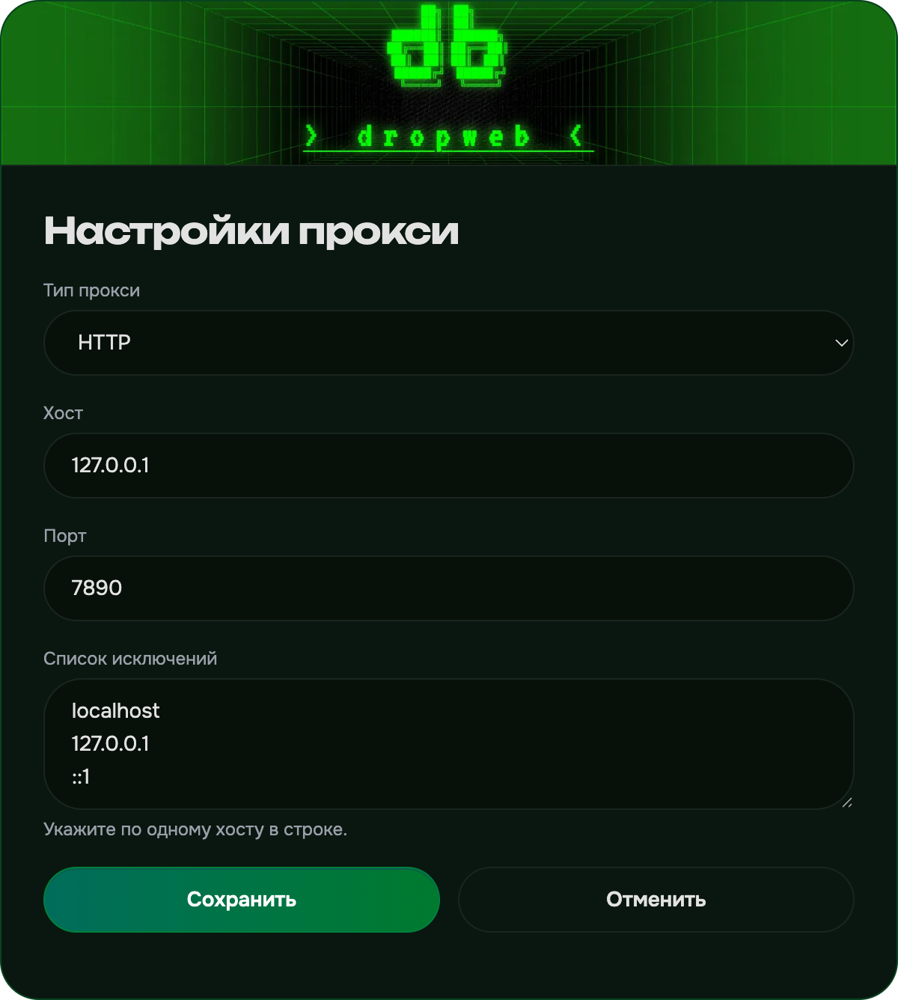

<div align="right">
  <a href="README.md">Русский</a>
</div>


<a href="https://github.com/enkinvsh/dropweb-proxy/releases">
  
</a>
<a href="https://github.com/enkinvsh/dropweb-proxy/stargazers">
  
</a>

<br>

<a href="https://github.com/enkinvsh/dropweb-proxy/releases">
  
</a>
<a href="https://github.com/enkinvsh/dropweb-proxy/releases">
  
</a>

---

**dropweb proxy** is a minimal Chrome and Firefox extension (Manifest V3) that turns the browser proxy on and off with a single button. One local profile (HTTP or SOCKS5), no data collection, no servers — just a clean switch.

<table>
  <tr>
    <td></td>
    <td></td>
    <td></td>
  </tr>
</table>

---

##  Features

- One proxy profile: type (**HTTP** or **SOCKS5**), host, port and bypass list
- Defaults: HTTP `127.0.0.1:7890`, bypass `localhost`, `127.0.0.1`, `::1`
- Power-button toggle in the popup; the toolbar icon reflects state — black-and-white when off, the colored dropweb logo when on, orange on a problem
- Automatic **WebRTC** leak protection while the proxy is on (Chrome routes WebRTC through the proxy; Firefox disables WebRTC)
- Edit the profile on the options page; saving while enabled re-applies immediately
- Native **RU / EN** localization

---

##  Install

Not in the stores yet — load an unpacked build from [Releases](https://github.com/enkinvsh/dropweb-proxy/releases), or build it yourself (below).

### Chrome / Chromium / Edge

1. Open `chrome://extensions` and turn on **Developer mode** (top right).
2. Click **Load unpacked** and select the `chrome-mv3` folder.
3. Open the toolbar popup and click the power button.

### Firefox

1. Open `about:debugging#/runtime/this-firefox`.
2. Click **Load Temporary Add-on…** and select `firefox-mv3/manifest.json`.
3. If enabling asks for private-window access, open `about:addons`, select the extension and set **Run in Private Windows: Allow**.

---

##  Permissions & privacy

The extension collects and transmits nothing — all settings are stored locally. It requests only the minimum permissions, with no site access (`host permissions`):

- **`proxy`** — apply the chosen proxy to the browser's network requests
- **`storage`** — store the profile and on/off state locally
- **`privacy`** — set the WebRTC IP-handling policy so the real IP cannot leak around the proxy
- **`alarms`** — a background reachability check that only updates the icon

**Fail-closed** by design: "on" means the settings were applied, not that the endpoint is reachable. The reachability check is advisory and never gates enable/disable.

Full [privacy policy](https://enkinvsh.github.io/dropweb-proxy/privacy-policy.html) — the extension collects no data.

---

##  Build from source

Requires [Bun](https://bun.sh).

```bash
bun install
bun run build:chrome    # -> .output/chrome-mv3
bun run build:firefox   # -> .output/firefox-mv3
bun run build           # both

bun run dev             # Chrome with hot reload
bun run check           # Biome + tsc (strict)
bun run test            # unit tests (Vitest)
```

##  License

**MIT** — a permissive license: the code may be used, modified, and distributed freely, including commercially, provided the copyright notice is kept. See [LICENSE](LICENSE). Third-party components: [THIRD-PARTY-NOTICES.md](THIRD-PARTY-NOTICES.md).

---

<sub>dropweb proxy is a tool for the privacy of your own traffic. Its use is governed by the laws of your country; the user is responsible for how it is used.</sub>
